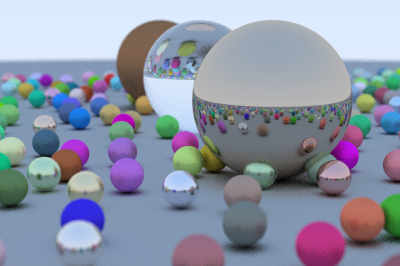

#SwiftRay
A simplistic Path tracer written in Swift.

## What is SwiftRay
I needed to create a project to gain experience in programming with Swift. The Path Tracer is based on the e-book [Ray Tracing in One Weekend](https://www.amazon.com/Ray-Tracing-Weekend-Minibooks-Book-ebook/dp/B01B5AODD8) by [Peter Shirley](http://in1weekend.blogspot.fr).

There are three books in the series, but SwiftRay is only based on the first one. The [original source code](https://github.com/petershirley/raytracinginoneweekend) is written in C++. You should follow along with the book, since it's cheap, and provides nice explanations.

##Features
- Antialiasing (by multisampling every pixel)
- Several materials: Lambertian (matte colour), Metal (reflective) and Dielectric (refractive)
- Depth-of-field blur

##Limitations
- There is only a single type of objects: Spheres!
- The algorithm is interesting but very slow:  the sample image above took 112 minutes to render on my Mac. Path tracing is slow by principle, and the algorithm in the book presents no kind of refinement.
- Multi-cores are not exploited (very doable since I use structs nearly everywhere)

## Supported plateforms
I only tried running it on my Mac, though there is no reason why it could not work on a iOS device, except that it runs through the command line. Try it on your brand new iPad Pro !

It can not work on other OSes, since it relies on Core Graphics to save the image to a PNG file. (It also imports Darwin for mathematical functions, but that can be replaced with libc on Linux).

##What programmers might find interesting
Take a look at Bitmap.swift which does low-level memory access to the bitmap. 

Vector.swift also contains overloaded operators. Thanks to Swift, the implementation is simple and elegant.